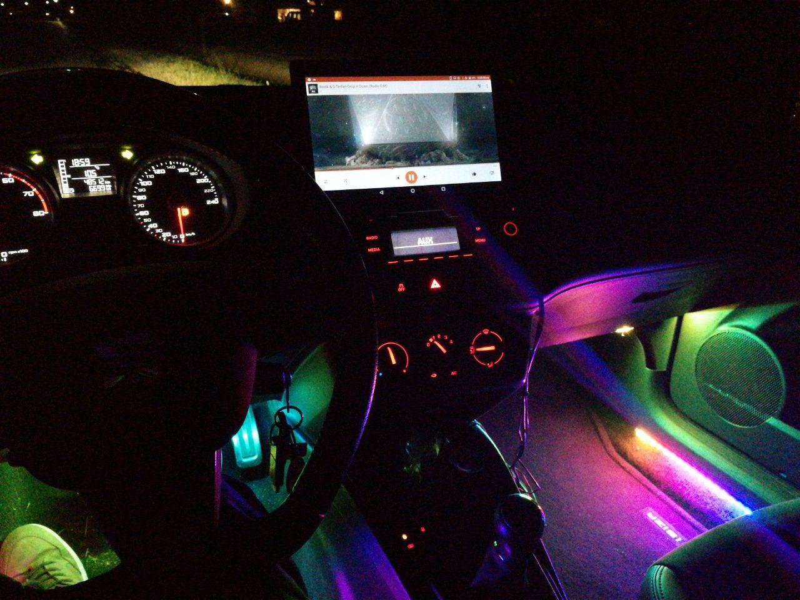
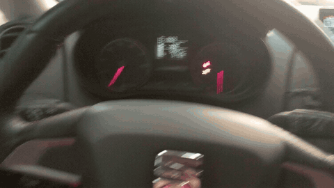
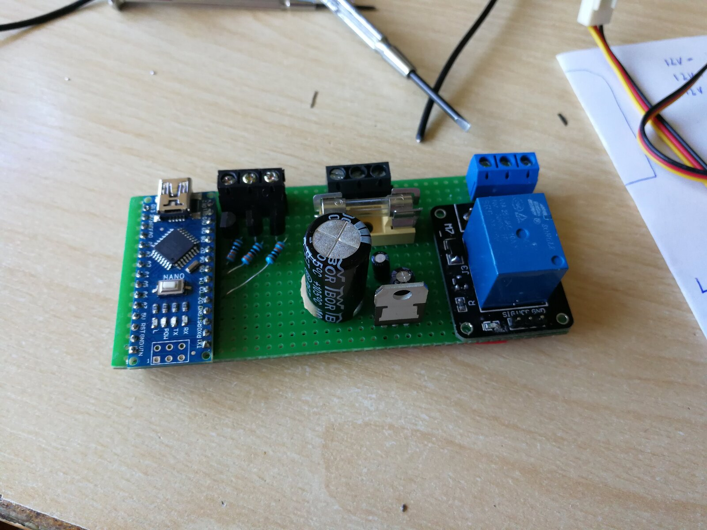
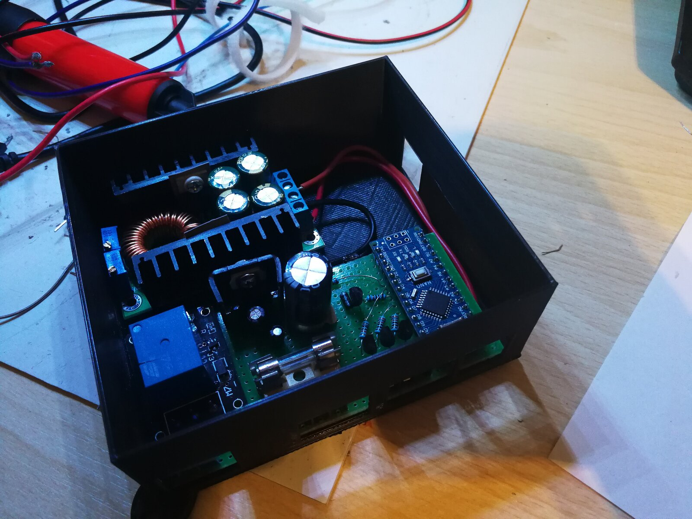

# seat-canbus

Ambient footwell and door lighting for a 2013 Seat Ibiza, driven by the car's own CAN bus.

An Arduino Nano listens to the comfort CAN bus through an MCP2515 module and drives two addressable
LED strips. The lights react to the car: the steering wheel buttons change colour, mode and brightness,
the door strips sweep orange with the turn signals, the front LEDs turn red when braking, and everything
dims when the headlights are on.





([Full video](media/demo.mp4))

## How it works

1. I reverse-engineered the comfort bus by logging every message with
   [`tools/canbus_finder.py`](tools/canbus_finder.py) and [`tools/canbus_monitor.py`](tools/canbus_monitor.py)
   while operating buttons, doors, lights and pedals. The results are in **[docs/can-ids.md](docs/can-ids.md)**.
2. The firmware has one message handler per CAN ID
   ([`firmware/src/carcanbus/messages/`](firmware/src/carcanbus/messages/)). Each turns raw bytes into events
   such as `onTurnLightLeftOn` or `onVolumeUpPress`.
3. The LED controller passes those events to the active LED mode
   ([`firmware/src/carled/ledmodes/`](firmware/src/carled/ledmodes/)).

The firmware only listens; it never sends anything on the bus.

## Controls

| Input | Colour mode | Rainbow mode |
|---|---|---|
| Steering wheel scroll up / down | Next / previous mode | Next / previous mode |
| Volume up / down | Next / previous colour | Faster / slower |
| Next / previous | Brighter / dimmer | |
| Turn signal | Orange sweep on that side's door strip | Orange sweep on that side's door strip |
| Brake | Front LEDs red | |
| Low beam on / off | Dim to 50 / back to 180 | Dim to 50 / back to 180 |

## Hardware

- Arduino Nano (ATmega328)
- MCP2515 CAN module on SPI: CS on D10, INT on D2
- Two WS2812 strips of 34 LEDs: left on D5, right on D6. LEDs 0–14 are the footwell, 15–33 run along the door.

The CAN module is connected to the comfort CAN bus, the same bus the factory radio uses, so the wires behind the
head unit are the easiest place to tap in.

The controller board (2018) is hand-built on perfboard: the Nano, a fused 12 V input, a 7805 regulator and a relay
that keeps the board powered for a few seconds after the ignition goes off. In the car it sits in a 3D-printed case
together with a DC-DC converter.

| Board | In its case |
|---|---|
|  |  |

The KiCad files in [`pcb/`](pcb/) are an early draft of this board.

## Building

```sh
cd firmware
pio run            # build
pio run -t upload  # flash the Nano
pio device monitor # log decoded events at 115200 baud
```

## History

The hardware was built in 2018. The commit history starts with the first sniffer script in August 2019 and follows the project
through the Arduino sketch, the move to PlatformIO and the split into CAN and LED modules.
